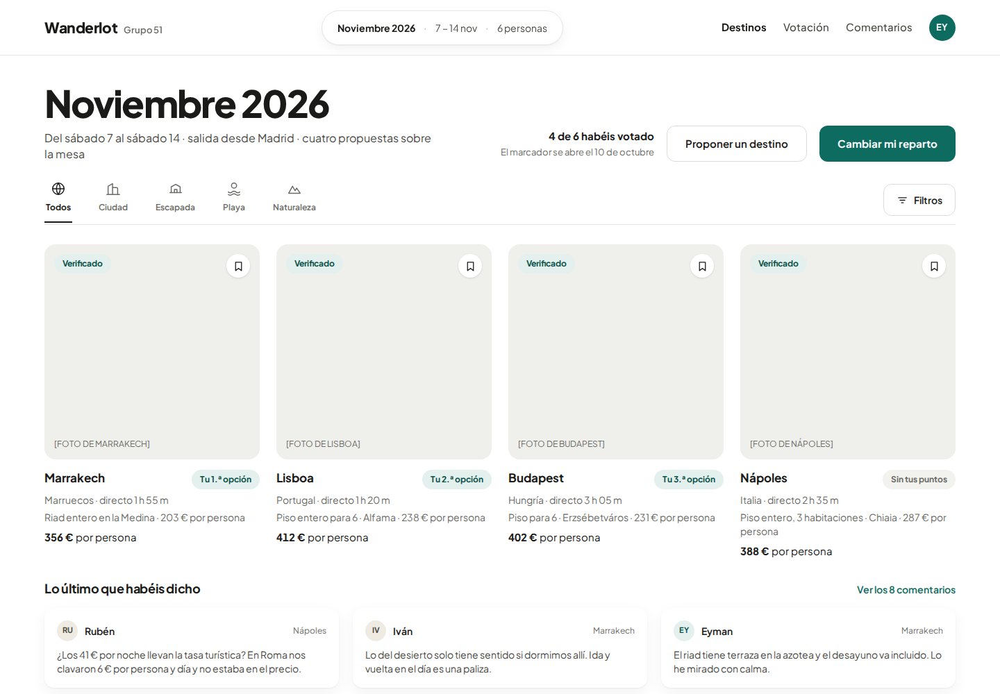
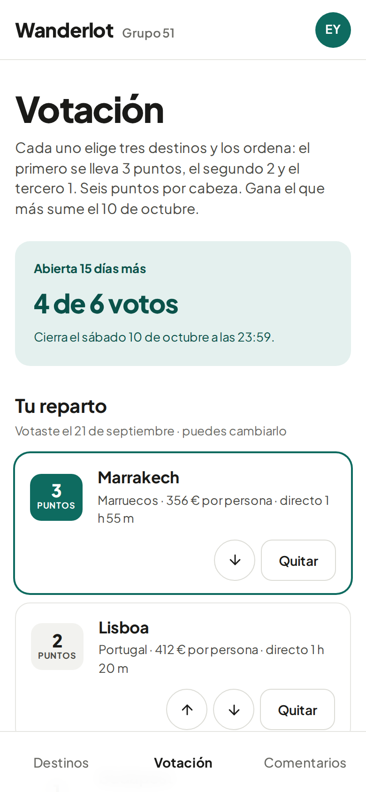
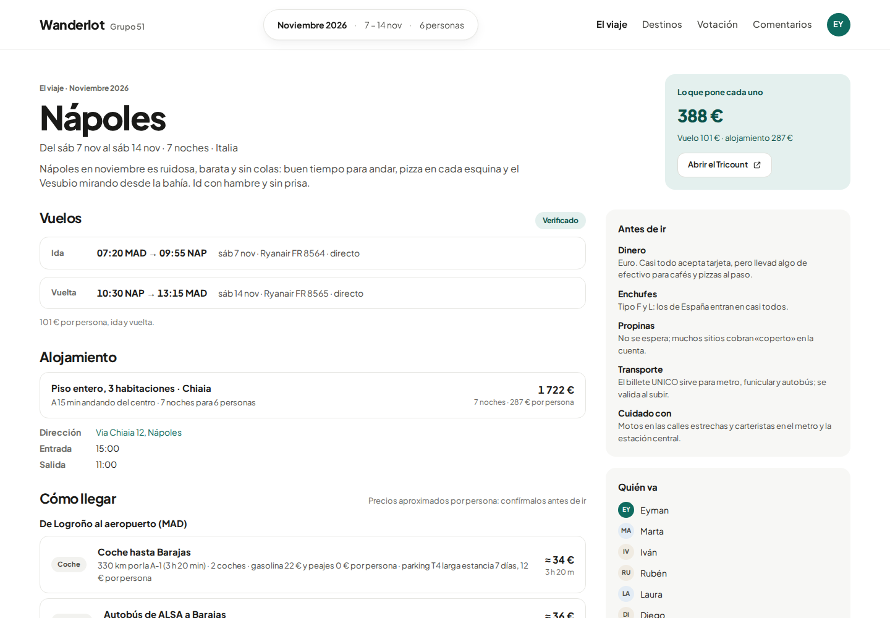
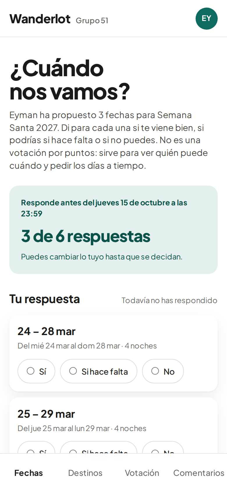
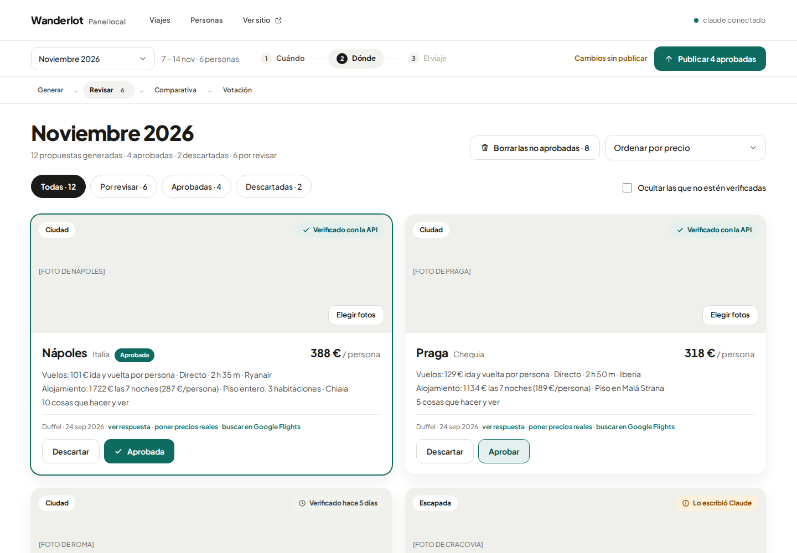
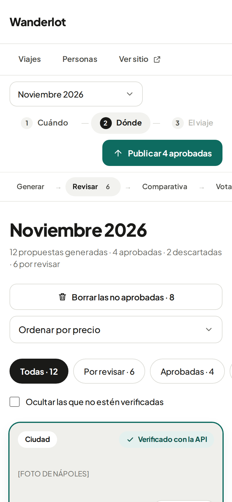

# Wanderlot

[](https://github.com/EymanEP/wanderlot/actions/workflows/ci.yml)

An open-source project for planning trips between friends. One person
organises: a **local panel** on their computer researches destinations with
Claude and curates them. Everyone else gets a **published site** where the
group reads the proposals, comments, and votes on where to go (each friend ranks
their top three). Nothing reaches the site until the organiser approves it.

Anyone can host their own copy for their group: one deployment serves one group
of friends. The site runs free on Cloudflare (Workers + D1); the panel runs on
the organiser's own computer. Friends join from a one-time invite, choose a
4-digit PIN and sign in with their name and PIN on any device (a passkey is
optional), and can add the site to their home
screen like an app. Hosting and setup:
[`docs/SPEC.md` §11](docs/SPEC.md#11-hosting-and-setup).

MIT licensed; contributions welcome (see [CONTRIBUTING.md](CONTRIBUTING.md)).
The full design is in [`docs/SPEC.md`](docs/SPEC.md).

| The friends' site | Ranking on a phone |
|---|---|
|  |  |

| The trip page, once decided | Agreeing on dates |
|---|---|
|  |  |

| The organiser's panel: reviewing proposals | The panel on a phone, at /admin |
|---|---|
|  |  |

<sub>Screenshots use the demo data, so photos appear as labelled placeholders.</sub>

## Layout

```
packages/core   shared model (zod), Borda tally, trust/staleness, voting rules,
                languages (copy in Spanish and English) and display helpers
                (euros, durations, dates)
packages/ui     the design system: tokens (theme.css), components, and a gallery
packages/mocks  mock data for "Noviembre 2026", taken from the design canvas
apps/panel      local-only app: Generar, Revisar, Comparativa
  src/            API (Hono)
  web/            UI (React + Tailwind, Vite)
apps/site       published app: Destinos, Destino, Votación, Comentarios
  src/            API (Hono): Cloudflare Worker + D1, or Node + node:sqlite
  migrations/     the database schema, for both
  web/            UI (React + Tailwind, Vite)
```

Stack: TypeScript everywhere, React 19, React Router 7, Tailwind CSS 4 (via
`@tailwindcss/vite`), Vite, Hono, zod, Vitest + Testing Library.

### Design system

`packages/ui` holds every visual building block; the apps compose pages from it
and never restyle primitives.

- **Tokens** live in `packages/ui/theme.css` as Tailwind `@theme` variables:
  colours (`ink`, `muted`, `accent`, `accent-soft`, `claude`, …), the type scale
  (`text-display`, `text-title`, `text-heading`, …), radii (`rounded-tile`,
  `rounded-card`) and shadows (`shadow-card`, `shadow-raised`, `shadow-pop`).
- **Components**: `Button`/`IconButton`, `Badge`/`ProvenanceBadge`, `Chip`/
  `ChoiceChip`, `Card`, `Avatar`, `Heading`/`Text`/`PageHeader`/`SectionHeader`,
  `StatTile`/`DataList`/`DataRow`/`ProsCons`/`BulletList`, `Photo`/`IataTile`,
  `Notice`/`StatusDot`/`Skeleton`/`EmptyState`/toasts, `TopBar`/`Brand`/
  `InfoPill`/`Main`/`Footer`, `IconTabs`, `Calendar`, `Dialog`, and the form
  controls `Field`, `TextInput`, `TextArea`, `Select`, `Stepper`, `Range`,
  `Checkbox`, `RadioCard`, `Fieldset`. Icons are in `icons.tsx`.
- `cn()` merges classes with tailwind-merge, so a `className` passed to a
  component always wins over its defaults.
- **Gallery**: `npm run dev -w @wanderlot/ui` (port 5175) shows every component
  in every state the screens use.

### Mock data

Both UIs talk to their own server by default. Build or run them with
`VITE_DATA=mock` to use `packages/mocks` instead (the previews do). Each app
reads and changes data through one interface (`SiteSource` in
`apps/site/web/src/data/source.ts`, `PanelBackend` in
`apps/panel/web/src/data/backend.ts`) with an HTTP and a mock implementation.
In the mocks, generation "streams" the design's twelve proposals on a timer and
"Verificar con la API" flips a proposal to verified after a second.

Screens:

| app | route | screen |
|---|---|---|
| panel | `/planes/nuevo` | create a plan: name, dates, origin, people, budget |
| panel | `/generar` | search form, proposals arriving, and the group's destination ideas to research |
| panel | `/revisar` | approve, discard, verify or type in checked prices, photos, publish |
| panel | `/comparativa` | side-by-side, editable pros/cons, in-vote checkbox |
| panel | `/votacion` | live count and each person's ballot, reminder, close early, tie-break, result message |
| panel | `/personas` | group name, who goes on the selected trip, who can get in: invites, PINs, closing sessions, removing access |
| site | `/entrar` | sign in with name and PIN (or a passkey) |
| site | `/i/:token` | accept a one-time invite by choosing a PIN (or creating a passkey) |
| site | `/p/noviembre-2026` | plan: destinations, recent comments, other plans, propose a destination |
| site | `/p/noviembre-2026/destinos/nap` | destination detail and comments |
| site | `/p/noviembre-2026/votacion` | rank three; scoreboard hidden until close |
| site | `/p/noviembre-2026/comentarios` | every comment, by destination |

Add `?estado=cerrada` to any site URL to preview it after the vote closes.

`npm run build:preview -w <package>` builds a UI into one self-contained HTML
page with in-memory routing, for sharing a clickable preview:
`@wanderlot/site` (with a switch between the open and the closed vote),
`@wanderlot/panel` (set `VITE_SITE_URL` for its "Ver sitio" link) and
`@wanderlot/ui` (the gallery).

The panel and the site share one contract, the `Snapshot` schema in
`packages/core`. Publishing is the only way data moves from panel to site.

## Hosting your own

One deployment serves one group. The site runs free on Cloudflare Workers + D1;
the panel runs on the organiser's computer, and the site serves it too at
`/admin` (without AI) once you set a password in Personas → "Panel en el móvil".

```sh
git clone https://github.com/EymanEP/wanderlot && cd wanderlot
npm install
npx wrangler login     # once, with a free Cloudflare account
npm run setup          # deploys the site, connects the panel, writes .env
npm run panel          # http://127.0.0.1:5151 → Personas → invite your friends
```

Passkeys belong to the site's address, so settle on it (the `workers.dev` one
or a custom domain) before inviting anyone. After pulling new code, run
`npm run deploy:site` again. Details: [`docs/SPEC.md` §11](docs/SPEC.md#11-hosting-and-setup).

## Running

Requires Node ≥ 22.13 (the Node site uses the built-in `node:sqlite`).

```sh
npm install
npm test            # vitest, all packages
npm run typecheck   # every package, servers and both UIs

# development: API + Vite with hot reload, in one terminal each
WANDERLOT_ADMIN_TOKEN=<32+ random chars> npm run dev:site    # UI on :5173, API on :8787
WANDERLOT_ADMIN_TOKEN=<same token> npm run dev:panel         # UI on 127.0.0.1:5174, API on :5151

# production: build the UIs, then each server serves its own
npm run build
WANDERLOT_ADMIN_TOKEN=… npm run start -w @wanderlot/site
npm run start -w @wanderlot/panel
```

In development Vite proxies `/api` to the API server, so open the Vite URL. To
sign in with passkeys through Vite, start the API with
`WANDERLOT_ORIGIN=http://localhost:5173`.

`npm run dev:worker -w @wanderlot/site` runs the site as a Cloudflare Worker
locally (`wrangler dev`, local D1; copy `apps/site/.dev.vars.example` to
`.dev.vars` first).

`npm run test:e2e` builds both UIs and runs, in Chromium with the browser's
virtual authenticator:

- the round trip (`e2e/roundtrip.e2e.ts`): in the panel, create a plan, name
  the group, add a friend, research with a stand-in `claude`, approve, publish
  and open the vote; then the friend takes the invite from the WhatsApp
  message, chooses a PIN and sees the plan;
- the site on its own (`apps/site/e2e/access.e2e.ts`): invite and PIN,
  signing in from a second device, trips only their people see, vote,
  comment, like, the optional passkey, removed access.

`npm run test:e2e:worker -w @wanderlot/site` runs the site checks against the
Worker in `wrangler dev` with a local D1 (no Cloudflare account needed). CI
(`.github/workflows/ci.yml`) runs typecheck, unit tests and all of the above on
every push and pull request.

The panel reads these from `.env` (written by `npm run setup`) or the environment.

| variable | used by | default |
|---|---|---|
| `WANDERLOT_ADMIN_TOKEN` | both | — (required by the site; on Cloudflare it's the `ADMIN_TOKEN` secret) |
| `WANDERLOT_DB` | site | `data/site.sqlite` |
| `WANDERLOT_ORIGIN` | site | `http://localhost:$PORT`; passkeys belong to this address, so set the final public one |
| `WANDERLOT_PIN_SECRET` | site | the admin token; keys the PIN hashes (on Cloudflare, the `PIN_SECRET` secret) |
| `WANDERLOT_SITE_URL` | panel | `http://localhost:8787` |
| `WANDERLOT_PANEL_DATA` | panel | `data/panel.json`: only with a site older than API version 10; the trips are kept on the site otherwise, and this file is moved there once |
| `ANTHROPIC_API_KEY` | panel | — (research through Anthropic's API) |
| `OPENAI_API_KEY`, `OPENAI_MODEL` | panel | — / `gpt-5` (research through OpenAI, with web search) |
| `AI_BASE_URL`, `AI_API_KEY`, `AI_MODEL`, `AI_NAME` | panel | — (any OpenAI-compatible endpoint; no web search, so prices are estimates) |
| `WANDERLOT_AI` | panel | the first AI set up; Ajustes changes it |
| `WANDERLOT_SITE_AI` | `deploy:site` | — (`1`: copy the AI keys to the site, so the panel at `/admin` reads screenshots and, with Claude's API or OpenAI, searches in the background) |
| `DUFFEL_API_KEY` | panel | — |
| `UNSPLASH_ACCESS_KEY`, `PEXELS_API_KEY` | panel | — (optional photo search) |
| `CLAUDE_BIN` | panel | `claude` |
| `WANDERLOT_BROWSER` | panel | the first of Chrome, Brave, Edge, Chromium found: the browser "Comprobar vuelos" opens (`chrome`, `brave`, `edge`, `chromium` or a path); Ajustes changes it |
| `WANDERLOT_BROWSER_PROFILE` | panel | `data/browser`: where each browser keeps its own profile, between runs |

## State

- Every designed screen is built, responsive down to phone width.
- Both UIs run on their servers: plans are created and researched in the
  panel, published to the site, and voted on by the friends on each trip, who sign in with a PIN. The
  whole path is covered end to end.
- Research runs through `claude -p --json-schema`, the Anthropic API or
  OpenAI's, each with web search, or any OpenAI-compatible endpoint without
  it (estimates); Ajustes picks one. All return proposals plus pros, cons,
  weather and photo subjects. None has been run against the real service
  from CI; they're tested with recorded shapes. With no AI, destinations can
  be added by hand.
- The finalists' flights can be checked in the browser: "Comprobar vuelos"
  has the `claude` command read Google Flights in a window of the
  organiser's own browser (Chrome, Brave, Edge or Chromium; Playwright MCP)
  and bring back the 5 best flights, priced as on the booking page, to pick
  one. The stay is checked by hand: the price dialog links to Airbnb with the
  trip's dates and people. Tested end to end with the real `claude` command
  and Chromium against local pages; not yet run against the real site from
  CI.
- Days off: once the dates are decided, each person says on the site whether
  they've got the days off work, and the organiser follows it in the panel
  before booking anything.
- Photos: Revisar's picker searches Wikimedia (no key), Unsplash and Pexels
  (with keys) and publishes the chosen ones with their credits (SPEC §6).
- The organiser follows the vote in the panel: who has voted, a reminder for
  the rest, closing early, breaking a tie, going somewhere other than the
  winner, and the result message.
- The panel's trips are kept on the site, and the site serves the panel at
  `/admin` for the organiser's phone; with an AI key shared, it reads
  screenshots and searches in the background.
- Dates can be agreed first: the organiser proposes a few windows, each friend
  says yes, if need be or no, and the chosen one becomes the trip's dates.
- Getting there counts: with the group's home town set, research estimates
  getting to each destination's departure airport and back (car or bus or
  train), and it's part of the per-person price the group votes on.
- Once the destination is decided, the trip gets its own page: flights and
  stay with the checked prices, how to get to the airport and from it, what
  to do, eat and see, what to know before going (drafted by Claude, edited by
  the organiser), each person's share and the group's Tricount.
- Friends can install the site on their phone's home screen.
- Languages: Spanish or English, everywhere. The organiser sets the
  group's language in Ajustes; each friend can switch the site for
  themselves from their account menu, and the organiser the panel (SPEC
  §12). The AI writes destinations and the guide in the group's language,
  and the messages for the group chat follow it too.
- Prices: research's are labelled as written by Claude. The organiser checks
  the finalists by hand, typing the prices or having Claude read screenshots
  of the flights and the stay. The site then shows only what was checked. The
  Duffel flight API is still a stub.
- It has been used for a real trip: a group chose its destination with it.
  What's next, from that trip, is in [docs/ROADMAP.md](docs/ROADMAP.md).

## Contributing

Issues and pull requests are welcome; start with
[CONTRIBUTING.md](CONTRIBUTING.md). Please report security problems privately
([SECURITY.md](SECURITY.md)).

## Licence

[MIT](LICENSE). Photos shown on a site keep their own licences and credits.
